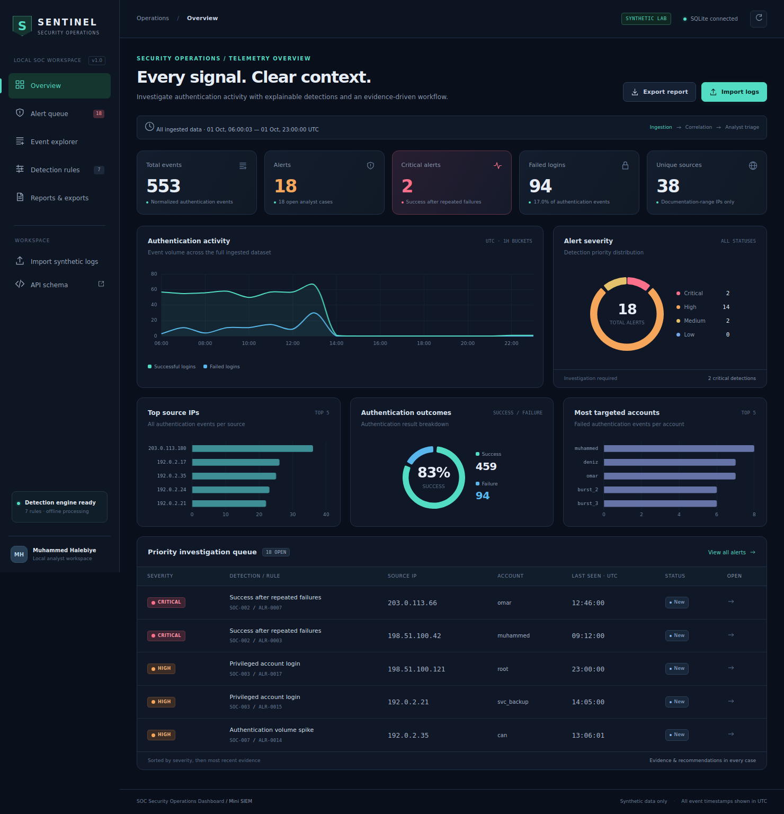
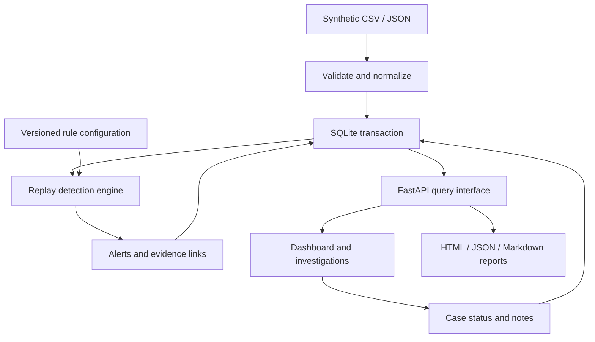
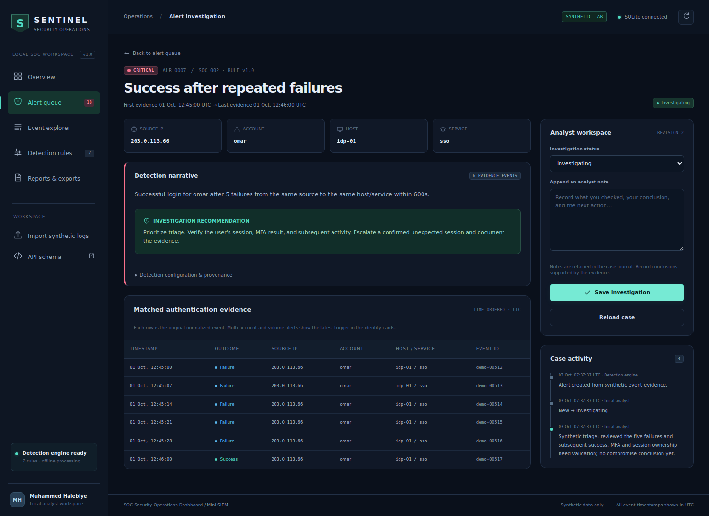

# SOC Security Operations Dashboard

**An offline Mini SIEM for authentication detection, evidence review, and analyst case management.**

Python · FastAPI · SQLite · JavaScript · Chart.js · Pytest · Docker

> **v1.1 Premium UI refresh** — calmer dark theme, softer contrast, improved spacing, refined cards/tables/forms, cleaner mobile behavior, and a more polished analyst workspace. The backend, detection logic, persistence, and report behavior are unchanged.




## Overview

SOC Security Operations Dashboard turns synthetic authentication logs into explainable security alerts. The Sentinel interface lets an analyst inspect the original evidence, record an investigation, change case status, and export a complete handover report.

This is a practical beginner-to-intermediate SOC portfolio project. It demonstrates the workflow from normalized telemetry to an analyst decision. It is a local learning application, with bounded datasets and transparent rules; it is not an enterprise SIEM or a production monitoring service.

## Why I built it

I wanted to move beyond reading individual log lines and learn how a SOC groups events, prioritizes signals, investigates evidence, and records a defensible conclusion. The focus is on understanding the detection logic and explaining engineering decisions in an interview.

A dashboard alone is not the result: each alert includes the rule, configuration snapshot, supporting events, investigation recommendation, and a persistent case journal.

## Architecture



- `models.py`: strict event contract, synthetic IP boundary, UTC normalization, case updates, and filters.
- `ingestion.py`: bounded CSV/JSON parsing; validates the entire upload before writing.
- `detection.py`: pure chronological replay with rolling-window correlations.
- `storage.py`: SQLite transactions, repositories, evidence links, optimistic case revisions, and dashboard aggregates.
- `main.py`: HTTP composition root, local request boundary, endpoints, and static interface.
- `reporting.py`: autoescaped HTML and safe Markdown/JSON exports.
- `static/`: responsive, accessible plain JavaScript interface and vendored Chart.js.

Events, detection results, and import metadata commit together. A failure rolls back the entire import. Analyst workflow data remains in SQLite across imports, replays, and restarts.

## Features

- Synthetic CSV and JSON ingestion with actionable validation errors.
- Stable event IDs, content fingerprints, duplicate skipping, and conflicting-ID rejection.
- Seven rules with severity, explanation, matched evidence, recommendations, and configuration provenance.
- Dashboard cards: total events, alerts, critical alerts, failed logins, unique sources.
- Five charts: event timeline, severity, source IPs, success/failure, targeted accounts.
- Direct investigation URLs, original normalized evidence, configuration snapshots, and case history.
- **New → Investigating → Closed** workflow, with manual reopening and append-only notes.
- Optimistic revisions: stale changes return HTTP 409 instead of overwriting another tab's work.
- Exact severity, source, username, rule, status, and inclusive date filters; literal text search and pagination.
- Multi-account and global alerts match source/account filters through **every evidence row**.
- Full filtered exports across all result pages in HTML, JSON, and Markdown.
- Offline assets, responsive mobile layouts, SQLite persistence, Docker configuration, and CI workflows.

## Detection rules

| Rule | Detection | Default condition | Severity |
| --- | --- | --- | --- |
| SOC-001 | Repeated failed authentication | At least 5 failures in 300 seconds, same source/account/host/service | High |
| SOC-002 | Success after repeated failures | Success after at least 5 failures in 600 seconds, same identity | Critical |
| SOC-003 | Privileged account login | Successful login by `root`, `admin`, or `svc_backup` | High |
| SOC-004 | Multiple accounts targeted | One source fails against at least 4 distinct accounts in 600 seconds | High |
| SOC-005 | Login outside business hours | Success outside Monday–Friday, 09:00–18:00, Europe/Istanbul | Medium |
| SOC-006 | Synthetic watchlist activity | Any authentication from the configured synthetic IP `203.0.113.66` | High |
| SOC-007 | Authentication volume spike | At least 20 authentication events across all sources in 60 seconds | High |

Windows include their endpoints. Successful authentication clears that identity's failure streak. Account equality is case-sensitive for correlation; the configured privileged account list is case-insensitive and uses exact names.

Rate rules (001, 004, 006, 007) combine matches into one UTC 15-minute episode per entity and configuration hash. Detection windows still cross episode boundaries. Single-login rules (002, 003, 005) use the triggering event's stable ID. All evidence contributing to an episode is retained; the displayed identity represents its latest trigger. The explanation describes the latest matching window, while the evidence table contains the union of matched windows.

Edit `config/detection.json` and restart to tune rules. Existing findings and analyst work remain historical records. A changed configuration hash creates separately attributable findings on replay. An enriched Closed case stays Closed until an analyst reopens it. See [detection design](docs/DETECTION_DESIGN.md) for boundary behavior and tradeoffs.

**A rule match is a triage hypothesis, not a confirmed compromise.**

## Screenshots

The screenshots are captured from the running application with synthetic data.

| View | Screenshot |
| --- | --- |
| Desktop overview | [Dashboard](docs/screenshots/dashboard-desktop.png) |
| Filtered queue | [Alert queue](docs/screenshots/alert-queue.png) |
| Evidence and analyst workflow | [Investigation](docs/screenshots/alert-investigation.png) |
| Normalized records | [Event explorer](docs/screenshots/event-explorer.png) |
| Explainable conditions | [Rule library](docs/screenshots/detection-rules.png) |
| Report formats | [Reports](docs/screenshots/reports.png) |
| Responsive overview | [Mobile dashboard](docs/screenshots/dashboard-mobile.png) |
| Responsive case | [Mobile investigation](docs/screenshots/investigation-mobile.png) |



## Installation

Use Python **3.11–3.13** from a source checkout. No Node.js or frontend build is required to run the application. Initial dependency installation requires internet access; the application then runs with local assets.

### Windows PowerShell

```powershell
cd soc-security-operations-dashboard
py -m venv .venv
.\.venv\Scripts\python.exe -m pip install -r requirements.txt
.\.venv\Scripts\python.exe -m app seed
.\.venv\Scripts\python.exe -m uvicorn app.main:app --host 127.0.0.1 --port 8000
```

### Linux / macOS / Kali

```bash
cd soc-security-operations-dashboard
python3 -m venv .venv
source .venv/bin/activate
python -m pip install -r requirements.txt
python -m app seed
python -m uvicorn app.main:app --host 127.0.0.1 --port 8000
```

Open **http://127.0.0.1:8000**. Keep the working directory at the repository root. Stop with Ctrl+C.

The application also supports an empty start: skip `seed`, open **Import logs**, and select **Load 553 synthetic events**. Both routes are idempotent.

## Usage

1. Load the sample dataset. The defaults produce **553 events, 18 alerts, 2 critical alerts, 94 failures, and 38 sources**.
2. Open **Alert queue**, filter to Critical, and investigate a success-after-failures case.
3. Read the failures and subsequent success in time order. Validate whether this is expected behavior before declaring compromise.
4. Set the status to Investigating and append a note with facts, uncertainty, and the next step.
5. Export the filtered queue from Reports. The output includes all matched evidence and your journal.
6. Close only after documenting the outcome. Reopen manually if new evidence needs attention.

Use Event explorer for the underlying telemetry and Detection rules for exact parameters and common false positives. All display times are UTC; alert date inputs use your browser's local timezone and are converted to UTC.

### Import contract

CSV header and JSON object keys:

```text
event_id,timestamp,source_ip,username,hostname,service,event_type,synthetic
```

```json
{
  "event_id": "lab-0001",
  "timestamp": "2026-10-01T12:00:00+03:00",
  "source_ip": "198.51.100.42",
  "username": "muhammed",
  "hostname": "vpn-gw-01",
  "service": "vpn",
  "event_type": "authentication_failure",
  "synthetic": true
}
```

JSON must contain an array of such objects. In CSV, use lowercase `true`. Timestamps require an explicit offset or `Z`. Only `authentication_success` and `authentication_failure` are accepted. Extra fields are rejected.

Only documentation addresses in `192.0.2.0/24`, `198.51.100.0/24`, `203.0.113.0/24`, and `2001:db8::/32` are accepted. Limits are 5 MiB/file, 5,000 events/import, and 20,000 stored events. These checks support a synthetic lab; they cannot prove that every submitted username is fictional. Never upload real logs or secrets.

`event_id` must identify one immutable event across CSV/JSON. Same ID and normalized content is a duplicate; same ID with changed content rejects the whole import. Distinct IDs are treated as distinct events even if their other fields are identical.

### CLI and API

```bash
python -m app generate-samples
python -m app import sample_data/security_events.csv
python -m app export html reports/investigation.html
python -m app export json reports/investigation.json
python -m app export markdown reports/investigation.md
```

The browser performs local REST requests. Mutations require `X-SOC-Client: dashboard`; JSON case updates also send `Content-Type: application/json` and the current `version`. Read the [API reference](docs/API.md) or `/openapi.json`.

### Configuration and persistence

| Setting | Default | Purpose |
| --- | --- | --- |
| `SOC_DB_PATH` | `data/soc.sqlite3` | SQLite file path |
| `SOC_CONFIG_PATH` | `config/detection.json` | Validated detection settings |

Database files, local environments, and secrets are ignored by Git. Back up the stopped application's database or use SQLite's backup API; copying an active WAL database alone can omit recent writes. To start another lab, select a new `SOC_DB_PATH` rather than deleting cases you need.

## Docker instructions

```bash
docker compose up --build -d
```

Open http://127.0.0.1:8000 and load the demo in the UI.

```bash
docker compose exec soc-dashboard python -m app seed
docker compose logs -f soc-dashboard
docker compose down
```

The named `soc-data` volume retains events and case notes after a container restart. The container runs as UID 10001, exposes a health check, and Compose publishes only to loopback. `docker compose down -v` deletes the lab volume: use it only when you intend to discard the saved cases.

A Docker daemon was not available in the build workspace, so a local container build/run is **not claimed**. The supplied CI container job builds the image, imports the demo, checks the non-root user, restarts the container, and verifies persistence when run on GitHub.

## Tests

```bash
python -m pip install -r requirements-dev.txt
python -m ruff check app tests scripts
python -m ruff format --check app tests scripts
python -m pytest --cov=app --cov-report=term-missing
```

Optional real-browser checks and screenshot regeneration:

```bash
npm ci
npx playwright install chromium
npm test
npm run screenshots
```

The browser script starts its own loopback server and temporary database; it does not modify your working dataset. Browser tests cover ingestion, charts, filtering, notes, stale updates, pagination, exports, mobile layouts, and a real server restart. On Linux, Playwright may require `npx playwright install --with-deps chromium`.

CI includes Python 3.11/3.12/3.13 tests, Ruff checks, browser checks, and Docker smoke checks. CI execution is pending until this repository is pushed. See [the recorded local verification](docs/VERIFICATION.md) for the actual results and environment.

## Project structure

| Path | Responsibility |
| --- | --- |
| `app/` | API, input models, detection, persistence, exports, CLI, and UI |
| `config/` | Validated rule configuration |
| `sample_data/` | Deterministic safe scenarios in CSV/JSON |
| `tests/` | Rule boundaries, API behavior, ingestion, persistence, and report tests |
| `scripts/` | Real-browser verification and release helpers |
| `.github/workflows/ci.yml` | Python, browser, and container checks |
| `docs/` | Architecture, API, detection design, verification, screenshots |
| `portfolio/` | Ready-to-embed project metadata and image assets |
| `LINKEDIN_POST.md` | English and Arabic announcement drafts |
| `CV_PROJECT_ENTRY.md` | Concise CV entries |
| `INTERVIEW_GUIDE.md` | Technical walkthrough and interview questions |
| `LEARNING_GUIDE_AR.md` | Step-by-step Arabic teaching guide |

## Security disclaimer

This project uses **synthetic authentication data only**. It has no malware, exploitation, scanning, credential attack, live threat-intelligence, or automated containment functionality. It does not contact the source IPs in uploaded events.

It is a single-analyst local lab without authentication or RBAC. The custom mutation header, same-origin checks, trusted hosts, parameterized SQL, CSP, and escaping reduce common local web risks; they are not substitutes for authentication. Keep it on loopback. Public deployment requires a separate security design, authentication/authorization, TLS, access controls, and operational hardening.

The watchlist is fictional. Privileged and out-of-hours activity can be legitimate. Cases are individual alerts; multi-alert incident grouping is a future feature. See [security design](docs/SECURITY.md).

## What I learned

- Normalization makes equivalent timezone and IP representations comparable.
- A rolling window and a correlation identity determine whether events actually belong together.
- Account diversity is different from raw failure volume.
- Evidence links and configuration snapshots make alerts explainable and reproducible.
- Atomic ingestion, immutable event IDs, and optimistic updates protect data integrity.
- A SOC conclusion needs context; alert severity alone cannot prove an incident.
- Useful tests check boundary behavior, persistence, input safety, and real user workflows.

## Future improvements

- Standard log adapters for a separately authorized, privacy-controlled environment.
- Streaming detection with event-time watermarks and late-event handling.
- Identity baselines and suppression rules for shifts, service accounts, and maintenance.
- Authentication/RBAC, attributed analyst identities, and protected audit records.
- Multi-alert incident grouping, ownership, and richer triage metadata.
- Database migrations, retention policies, and PostgreSQL for larger workloads.
- Incremental correlation and paged evidence/report generation for scale.

## Career and portfolio materials

Start with [the Arabic learning guide](LEARNING_GUIDE_AR.md), rehearse [the interview guide](INTERVIEW_GUIDE.md), and use the [CV entry](CV_PROJECT_ENTRY.md) after you can explain the project. [Portfolio assets](portfolio/README.md) include screenshots and structured metadata for a future personal website.

MIT licensed. Chart.js retains its upstream MIT notice; see [third-party notices](THIRD_PARTY_NOTICES.md).
